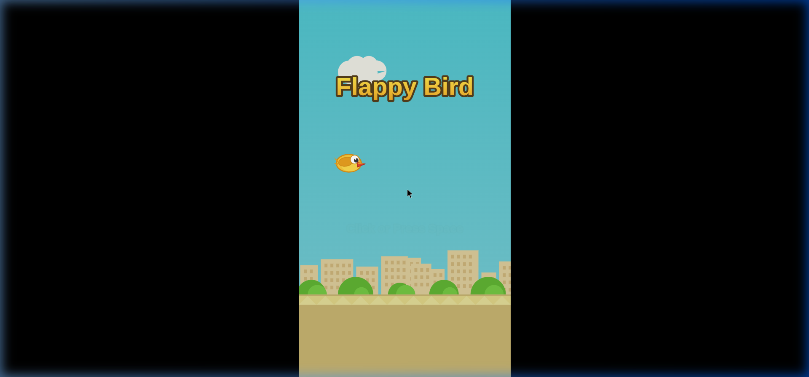

# 🐤 Flappy Bird — HTML5 Clone

A faithful recreation of the classic **Flappy Bird** game built entirely with **HTML5 Canvas** and **vanilla JavaScript** — no frameworks, no dependencies, just pure code.



## 🎮 Play Now

Simply open `index.html` in any modern web browser — no server required!

### Controls
| Input | Action |
|-------|--------|
| **Click / Tap** | Flap |
| **Spacebar** | Flap |
| **↑ Arrow** | Flap |

## ✨ Features

- **Authentic Visuals** — Pixel-art style bird with flapping wing animation, gradient green pipes with caps, scrolling parallax background with clouds, city skyline, bushes, and diagonal-striped ground
- **Classic Gameplay** — Gravity physics, pipe gaps, score tracking, and collision detection just like the original
- **Sound Effects** — Flap, score, hit, and death sounds generated via the Web Audio API (no audio files needed)
- **Game Over Panel** — Score & Best score display, medal system (Bronze 🥉, Silver 🥈, Gold 🥇), and a PLAY button to restart
- **Persistent High Score** — Your best score is saved in `localStorage` so it survives page refreshes
- **Responsive** — Automatically scales to fit any screen size
- **Zero Dependencies** — Single HTML file, runs anywhere with a browser

## 🏗️ Tech Stack

| Technology | Purpose |
|------------|---------|
| HTML5 Canvas | Rendering & Animation |
| Vanilla JavaScript | Game Logic & Physics |
| Web Audio API | Sound Effects |
| localStorage | High Score Persistence |

## 📁 Project Structure

```
flappy-bird/
├── index.html    # The complete game (single file)
└── README.md     # This file
```

## 🚀 Getting Started

```bash
# Clone the repository
git clone https://github.com/nur-ul-amin/HTMl-based-Flappy-Bird-Game.git

# Open in browser
open index.html
# or on Linux
xdg-open index.html
```

## 📜 License

This project is open source and available for educational purposes. The original Flappy Bird game was created by Dong Nguyen / .Gears Studios.

---

*Built with ❤️ using HTML5 Canvas*
